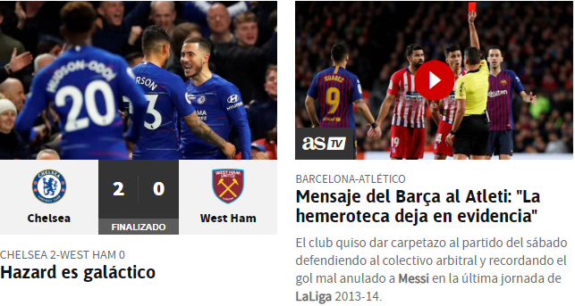

# PracticaVisualStudio
#creacion del repositorio
<!DOCTYPE html>
<html>

<head>
    <meta charset="UTF-8" />
    <title>Cracks Pagina Oficial</title>
</head>

<body>
    <header>
        
    </header>
    <h1>Cracks Pagina Oficial de Futbol</h1>
    <nav>
        <ul>

            <li>1 <a href="index.html">Página principal</a></li>
            <li>2 <a href="Noticias.html">Noticias</a></li>
            <li>3 <a href="Partidos.html">Partidos</a></li>
            <li>4 <a href="Traspasos.html">Traspasos</a></li>
            <li>5 <a href="Videos.html">Videos</a></li>
            <li>6 <a href="EquiposFav.html">Estadisticas</a></li>
        </ul>
    </nav>
    <section>
        <article>
            <h2>
                El informativo sobre fútbol internacional más grande y más visto de YouTube.
                Las noticias, curiosidades,polémicas, videos y lo que no se ve en los noticieros,
                AQUÍ. En la mejor pagina de fútbol
            </h2>
            

        </article>

        <aside>
            
        </aside>

        <aside>
            
        </aside>

    </section>

    <section>
        <aside>
            
        </aside>
    </section>

    <footer>
        Bryam Barrera &#8226; Universidad Politécnica Salesiana &#8226;
        telefono: <a href="tel:+593990496213">(593) 990-496-213</a> &#8226;
        Correo: <a href="mailto:bbarrerac1@est.ups.edu.ec">bbarrerac1@est.ups.edu.ec</a> &#8226;
        &#169; Todos los Derechos Reservados
    </footer>

</body>

</html>